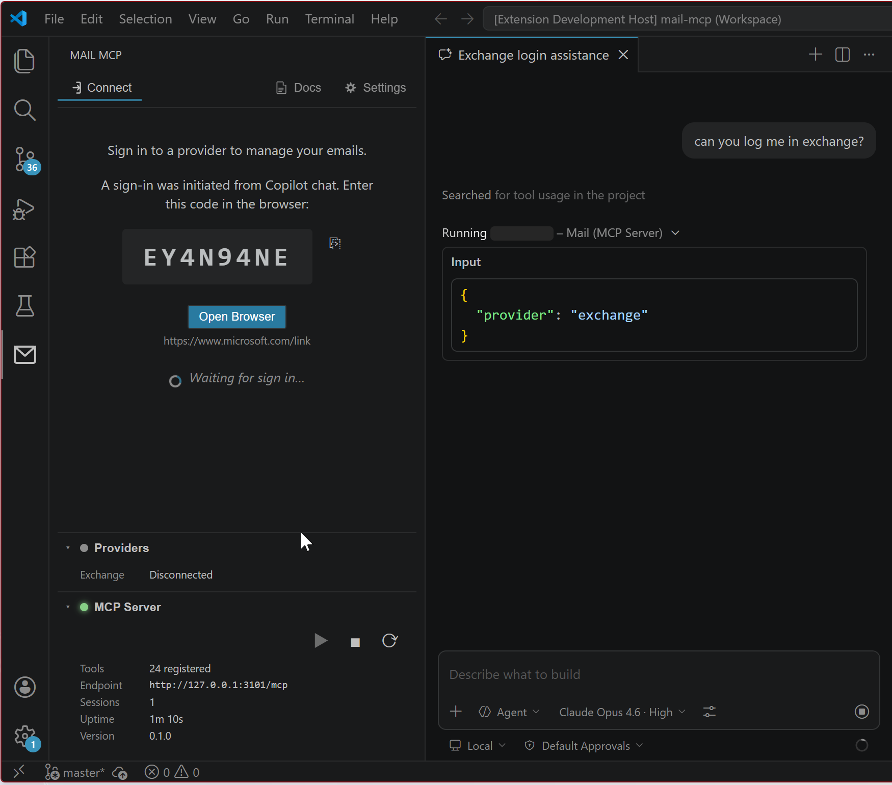
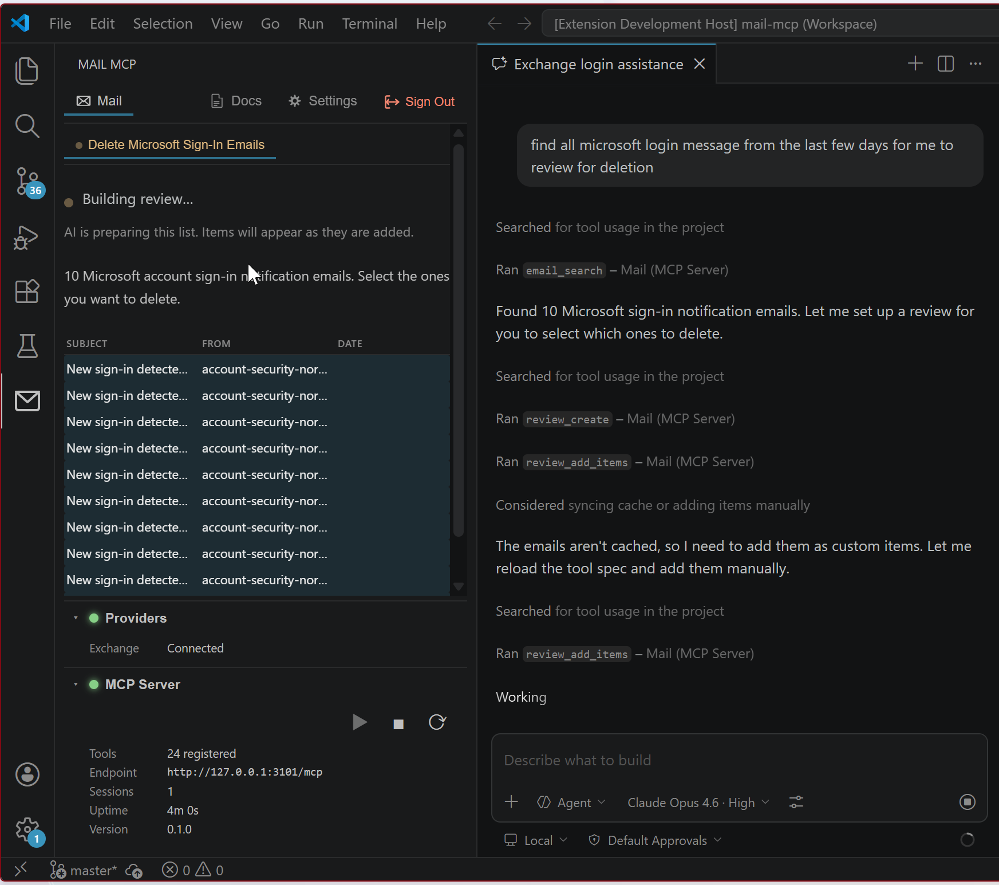
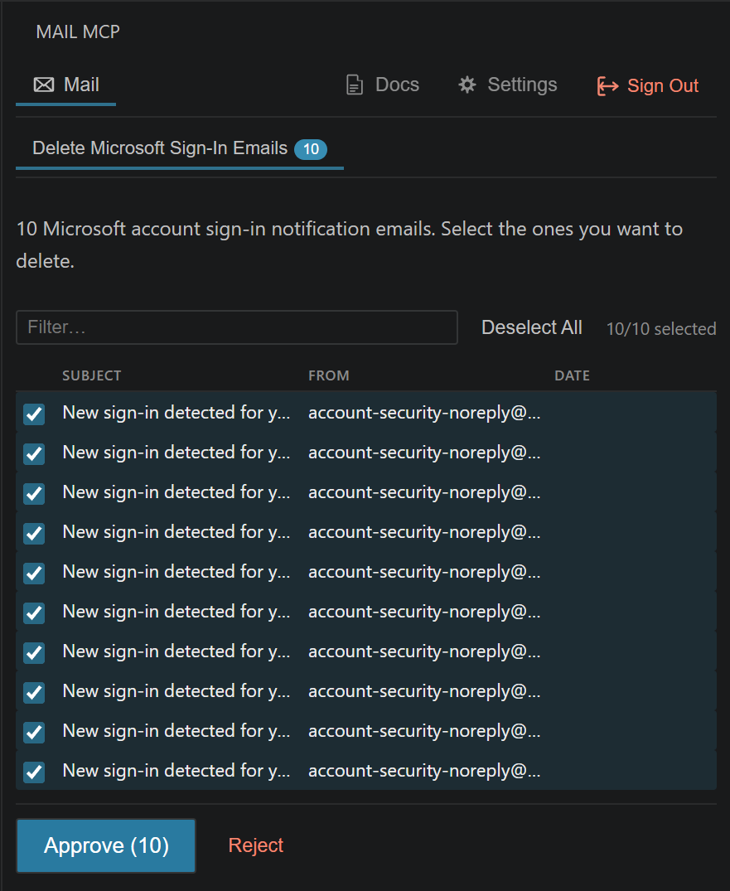
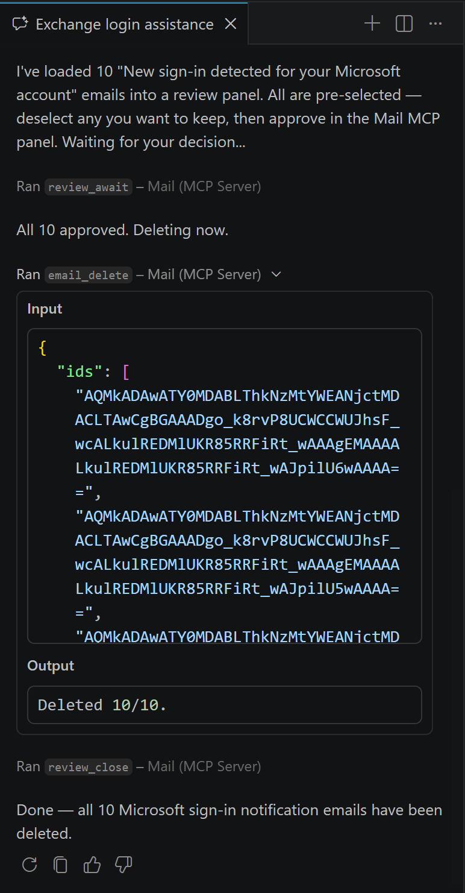
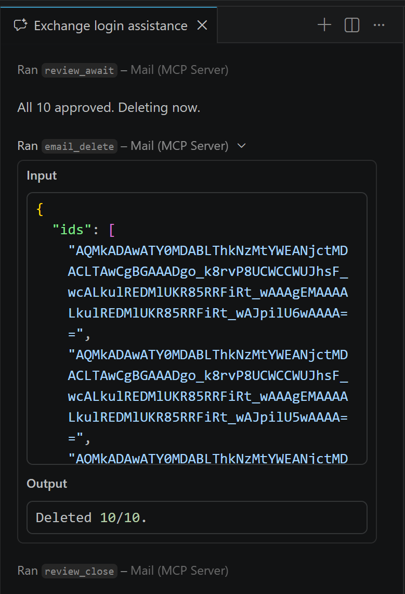
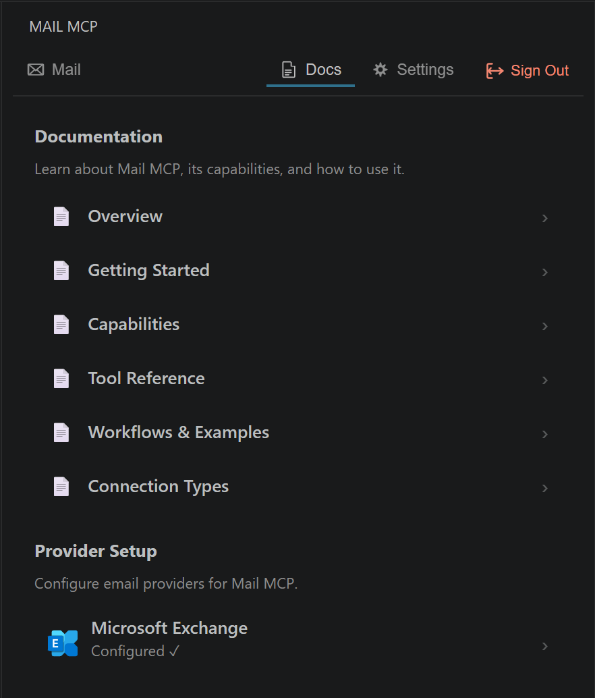
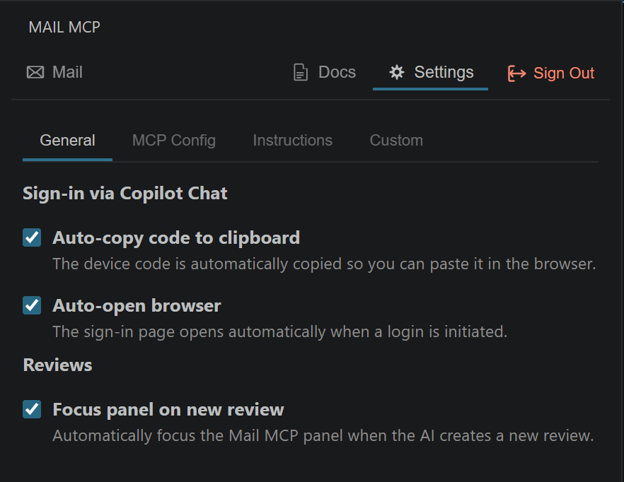

<p align="center">
  
</p>

<h1 align="center">
<pre>
╔╦╗┌─┐┬┬    ╔╦╗╔═╗╔═╗
║║║├─┤││    ║║║║  ╠═╝
╩ ╩┴ ┴┴┴─┘  ╩ ╩╚═╝╩  
</pre>
</h1>

<p align="center">
  <strong>Give AI assistants secure, human-in-the-loop access to your email.</strong>
</p>

<p align="center">
  <a href="https://marketplace.visualstudio.com/items?itemName=Drizztdourden.mail-mcp-extension"></a>
  <a href="LICENSE"></a>
  <a href="https://github.com/drizztdourden08/mail-mcp/issues"></a>
</p>

---

Mail MCP is a **Model Context Protocol (MCP) server** and **VS Code extension** that lets AI assistants (Copilot, Claude, etc.) read, search, organize, and clean up your email — with you in the loop approving every destructive action.

## ✨ Features

| Feature | Description |
|---------|-------------|
| **24 MCP Tools** | List, search, read, move, delete, unsubscribe, cache, and review emails |
| **Human-in-the-Loop** | AI proposes actions → you approve/reject in a visual checklist |
| **High-Performance Cache** | Sync 500+ emails to memory for instant search & filtering |
| **Device Code Auth** | Secure OAuth 2.0 sign-in — code auto-copied, browser auto-opened |
| **Provider-Agnostic** | Plugin architecture — Exchange today, more providers tomorrow |
| **Built-in Docs** | Overview, setup guides, tool reference, and workflows in the panel |
| **Custom Instructions** | Override or extend the AI's behavior from extension settings |

## 📸 Screenshots

<details>
<summary><strong>Sign-in Flow</strong> — Device code auth initiated from Copilot chat</summary>
<p align="center">
  
</p>
Ask the AI to log you in — it triggers a device code flow. The code is auto-copied to your clipboard and the browser opens automatically.
</details>

<details>
<summary><strong>Review Building</strong> — AI searches and builds a review list</summary>
<p align="center">
  
</p>
The AI searches for emails matching your criteria, creates a review, and adds items. You see them appear in real-time in the panel.
</details>

<details>
<summary><strong>Review Approval</strong> — Visual checklist with approve/reject</summary>
<p align="center">
  
</p>
All items are pre-selected. Filter, deselect what you want to keep, then approve or reject the batch.
</details>

<details>
<summary><strong>Chat: Full Workflow</strong> — AI awaits your decision, then acts</summary>
<p align="center">
  
</p>
The AI waits for your approval via <code>review_await</code>, then executes <code>email_delete</code> on the approved items and closes the review.
</details>

<details>
<summary><strong>Chat: Deletion Result</strong> — Confirmed deletion with tool output</summary>
<p align="center">
  
</p>
The AI confirms all 10 approved emails were deleted, showing the tool input/output for full transparency.
</details>

<details>
<summary><strong>Documentation</strong> — Built-in docs and provider setup</summary>
<p align="center">
  
</p>
Overview, getting started, capabilities, tool reference, workflows, and connection guides — all accessible from the Docs tab. Provider setup with configuration status.
</details>

<details>
<summary><strong>Settings</strong> — Configurable extension behavior</summary>
<p align="center">
  
</p>
Configure auto-copy device code, auto-open browser, review panel focus, MCP config, custom AI instructions, and more.
</details>

## 🏗️ Architecture

```
┌─────────────────┐         ┌──────────────┐
│  MCP Client     │◄─stdio─►│  MCP Server  │
│  (AI Agent)     │         │  (Node.js)   │
└─────────────────┘         └──────┬───────┘
                                   │ IPC (HTTP)
                            ┌──────┴───────┐
                            │  VS Code     │
                            │  Extension   │
                            └──────┬───────┘
                                   │ Webview
                            ┌──────┴───────┐
                            │  Review UI   │
                            │  (React)     │
                            └──────────────┘
```

- **MCP Server** — Handles all email API communication, tool execution, session management
- **VS Code Extension** — Authentication bridge, server lifecycle, webview host
- **React Webview** — Auth UI, review panels, settings, documentation viewer

## 🚀 Quick Start

### 1. Install

Install **Mail MCP** from the [VS Code Marketplace](https://marketplace.visualstudio.com/items?itemName=Drizztdourden.mail-mcp-extension).

### 2. Configure Your Email Provider

You need an Azure AD app registration for Microsoft Exchange:

1. Go to [Azure Portal](https://portal.azure.com) → Azure Active Directory → App registrations
2. Create a new registration with these API permissions: `User.Read`, `Mail.Read`, `Mail.ReadWrite`
3. Enable **Device Code Flow**: Authentication → Allow public client flows → Yes
4. Copy the **Application (client) ID**

See the **Docs** tab in the Mail MCP panel for detailed step-by-step instructions.

### 3. Set Your Client ID

**Option A** — VS Code Settings:
> Settings → Extensions → Mail MCP → Client ID

**Option B** — Environment variable:
```env
MAIL_MCP_CLIENT_ID=your-client-id-here
```

**Option C** — `.env` file in the project root:
```env
MAIL_MCP_CLIENT_ID=your-client-id-here
```

### 4. Connect

1. Open the Mail MCP sidebar panel (envelope icon in the activity bar)
2. Click **Connect** and complete the sign-in flow in your browser
3. The MCP server starts automatically

### 5. Use with Your AI

Once connected, your AI assistant can access your email through MCP tools. Try:

- *"Find all newsletters in my inbox"*
- *"Help me clean up my inbox — find junk and promotions"*
- *"Find all emails from my bank and move them to a Finance folder"*
- *"Unsubscribe me from mailing lists I never read"*

## 🔧 MCP Client Configuration

### VS Code (Copilot)

The extension auto-registers with VS Code's MCP system. No manual config needed.

### Claude Desktop

Add to `claude_desktop_config.json`:

```json
{
  "mcpServers": {
    "mail-mcp": {
      "command": "node",
      "args": ["path/to/packages/mcp-server/dist/index.js"],
      "env": {
        "MAIL_MCP_CLIENT_ID": "your-client-id-here"
      }
    }
  }
}
```

### Other MCP Clients

Any client that speaks the Model Context Protocol can connect. Point it at the server entry:

```bash
node packages/mcp-server/dist/index.js
```

With the `MAIL_MCP_CLIENT_ID` environment variable set.

## 🛡️ Security & Safety

> **You are responsible for controlling your AI assistant.**

While Mail MCP's default instructions tell the AI to use the review workflow before taking destructive actions, **there is no technical enforcement preventing the AI from calling tools directly.** The review system is a safety net, not a guarantee.

- **Monitor** what the AI is doing
- **Revoke access** if the AI misbehaves
- **Keep backups** of important emails
- Use AI clients that respect tool safety boundaries

## 📦 Project Structure

```
mail-mcp/
├── packages/
│   ├── extension/    # VS Code extension (TypeScript)
│   ├── mcp-server/   # MCP server (TypeScript, ESM)
│   └── webview/      # React webview UI (Vite)
├── test/             # UI tests (Playwright)
├── .env.example      # Environment variable template
└── package.json      # Workspace root (npm workspaces)
```

## 🧑‍💻 Development

```bash
# Install dependencies
npm install

# Build everything
npm run compile -w packages/extension
npm run build -w packages/mcp-server
npm run build -w packages/webview

# Watch mode (extension)
npm run watch -w packages/extension

# Watch mode (webview)
npm run dev -w packages/webview
```

Press **F5** in VS Code to launch the Extension Development Host.

## 🤝 Contributing

Contributions are welcome! Please open an issue first to discuss what you'd like to change.

1. Fork the repo
2. Create a feature branch (`git checkout -b feature/my-feature`)
3. Commit your changes (`git commit -m 'Add my feature'`)
4. Push to the branch (`git push origin feature/my-feature`)
5. Open a Pull Request

## 📄 License

[MIT](LICENSE) © [Drizztdourden_](https://github.com/drizztdourden08)
